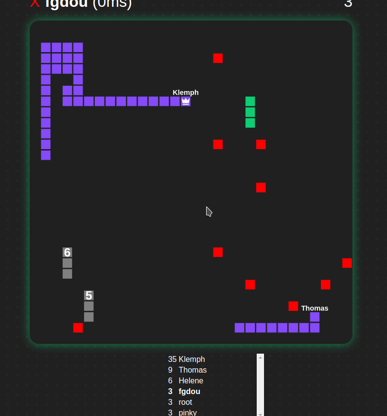

ESIR3 SR Project - Multiplayer Snake Game
===




A multiplayer snake game.

# Demo
You can access the game at https://sr.fgdou.ovh/

# Members
- [Fabien GOARDOU](https://fabiengoardou.fr/)

# Documents
- [Design File](./doc/design.md)
- [Report](./doc/report.md)
- [Oral presentation](./doc/presentation.pdf) 

# Docker
## Run it on your server
Just run :
```sh
docker run -p 80:80 ghcr.io/fgdou/sr_project:master
```
And access the website on http://localhost

## Persistent leaderboard storage
The file is located in `/app/leaderboard.json`

You can setup the persistent storage in the `compose.yml` file or by adding `-p /path/to/dir:/app/leaderboard` to the `docker run` command.

## Build the project and Run
```sh
docker compose up --build
```

# Development
- [frontend](./frontend/)
- [backend](./backend/)
- [loadtesting](./loadtesting/)