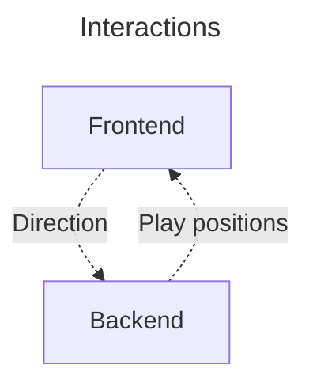
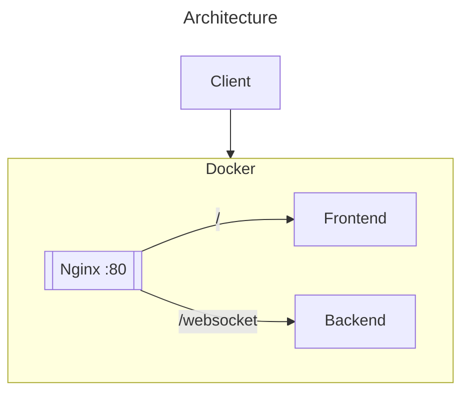

# Design

## Idea
The idea is to create a snake game, but multiplayer. The idea is to copy the classical game :
- a fixed size grid
- only one apple for everyone
- movement every time $t$
- every apple increment the size of the player

## Architecture
The architecture is frontend - backend. The project can be run with a `docker-compose` file that runs everything. The pipeline allows the build and test of the project at every commit, and deploy the main branch.

The entire project will be written in Rust. 
The idea is to create a performant web-app, that can handle a large amount of users.

### Backend
It will handle all the game logic. The position and the direction is stored here. It will receive the command from the users for the direction, and send the position of everyone and the apple.

### Frontend
The frontend will draw the players sent by the server. It will also send every keys sent by the user.