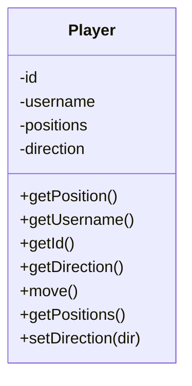

```mermaid
classDiagram

class Player {
    -id
    -username
    -positions
    -direction

    +getPosition()
    +getUsername()
    +getId()
    +getDirection()
    +move()
    +getPositions()
    +setDirection(dir)
}


```