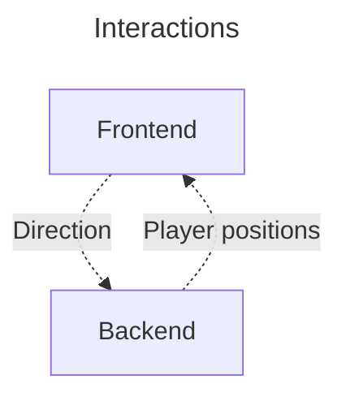
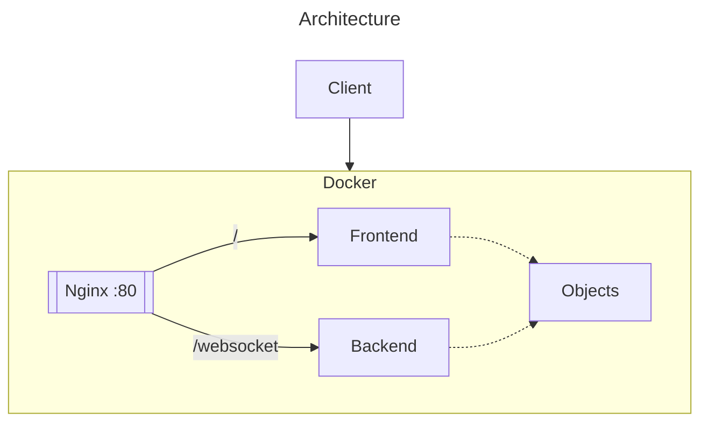

# Design

# Idea
The idea is to create a snake game, but multiplayer. The idea is to copy the classical game :
- a fixed size grid
- only one apple for everyone
- movement every time $t$
- every apple increment the size of the player

# Architecture
The architecture is frontend - backend. The project can be run with a `docker-compose` file that runs everything. The pipeline allows the build and test of the project at every commit, and deploy the main branch.

The backend will be written in Rust, and rhe frontend in typescript. Rust will be usefull to have a performant backend, and typscript will be the easiest for frontend development but will still allow for type checking.

## Backend
It will handle all the game logic. The position and the direction is stored here. It will receive the command from the users for the direction, and send the position of everyone and the apple.

## Frontend
The frontend will draw the players sent by the server. It will also send every keys sent by the user.

### Ping reliability
The `Client` classcalculate the average time difference that the network takes. With  this estimation, it can smooth out the receiving of packet, so that the game seems smoother.

## Docker
Docker allows this app to be run on any devices. I chose to put the front and backend in the same docker, to be able to run it with a really simple command : `docker run app`. It runs the front with nginx, and the back with a binary. The image is small : 110MB.

# Dependencies
- webassembly : run the rust code in the browser and interact with the page
- websocket : communicate between the front and back

# Sprints
1. basic functionnalities
    1. select username
    1. the player can move on a grid
    2. the player can eat an apple and grow
    3. on the walls, loop back
2. death
    1. the player loose if it hits any snake (himself or another player)
    2. the player loose if it hits a wall
3. loosing / winning screen
    1. if a player loose, a popup shows
    2. at the end, a scoreboard is shown
4. advance player movement
    1. handle rollback
