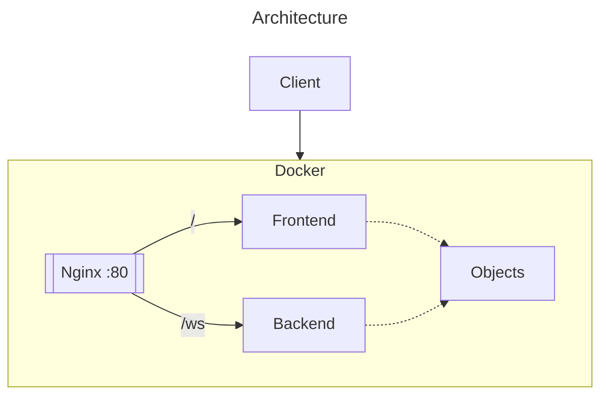
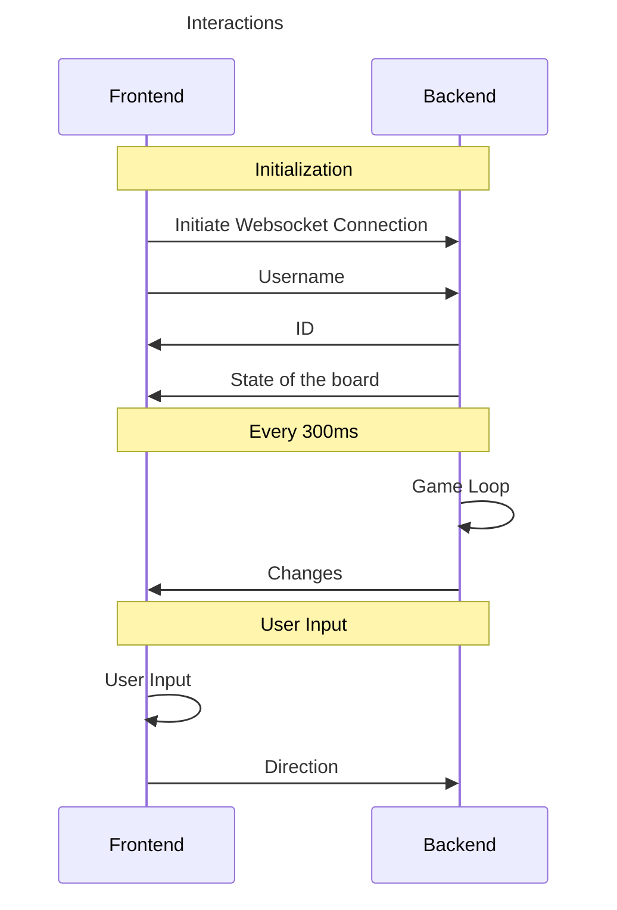

Design
===

# Idea

The idea is to create a snake game, but multiplayer. The idea is to copy the classical game :
- a fixed size grid
- only one apple for everyone
- movement every time $t$
- every apple increment the size of the player

# Architecture
The architecture is **frontend - backend**. The project can be run with a `docker-compose` file that runs everything. The pipeline allows the build and test of the project at every commit, and deploy the main branch.

The backend will be written in **Rust**, and the frontend in **Typescript**. 

Rust is usefull to have a performant backend. It is also very handy for a lot of usecase in this project, because it is  a functional programming language. Many `enum` are used to transfer data accross the front and backend.

Typscript will be the easiest for frontend development but will still allow for type checking. I chose to not work with any frameworks, because this is a simple frontend.

## Link between Frontend and Backend
The rust crate `ts-rs` provides a compilation from the Rust objects to typescript. In that way, we can use in the frontend the exact objects defined in the backend.

The messages are the followings :
- send the entier game state via the [`Infos`](../backend/src/objects/infos.rs) object
- send only the changes via the [`Event`](../backend/src/objects/infos_change.rs) object

## Backend
It handles all the game logic. The position and the direction is stored here. It receives the command from the users for the direction, and first sends the position of everyone and the apple.

## Frontend
The frontend will draw the players sent by the server and send every keys sent by the user. It will also execute the game logic for the client, as the server will only send basic modifications of the game : 
- change direction of the player
- new player
- eating an apple

## Docker
Docker allows this app to be run on any devices. I chose to put the front and backend in the same docker, to be able to run it with a really simple command : `docker run app`. It runs the front with nginx, and the back with a binary. The image is small : 110MB.

The build steps are defined in the [`Dockerfile`](../Dockerfile). To avoid CORS errors, nginx is used to link the front and backend on the same url and port.

# Dependencies
- webassembly : run the rust code in the browser and interact with the page
- websocket : communicate between the front and back
- serde : transforms rust object instances to json

# Sprints
1. basic functionnalities
    1. select username
    1. the player can move on a grid
    2. the player can eat an apple and grow
    3. on the walls, loop back
2. death
    1. the player loose if it hits any snake (himself or another player)
    2. the player loose if it hits a wall
3. loosing / winning screen
    1. if a player loose, a popup shows
    2. at the end, a scoreboard is shown
4. advance player movement
    1. handle rollback
