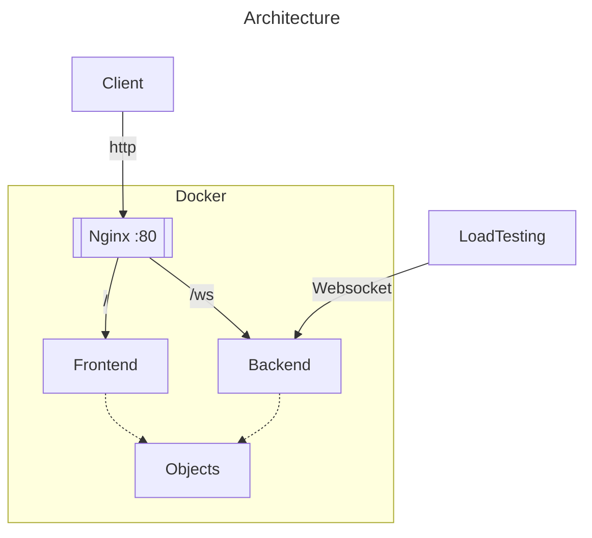
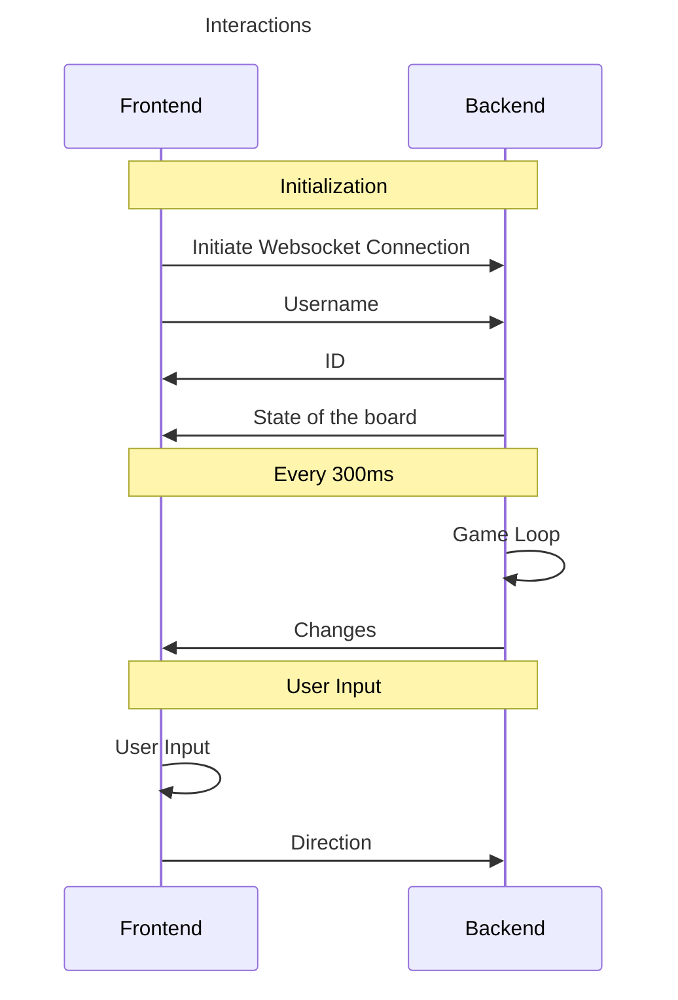

Design
===

# Architecture
The architecture is **frontend - backend**. The project can be run with a `docker-compose` file that runs everything. The pipeline allows the build and test of the project at every commit, and deploy the main branch.

The backend is written in **Rust**, and the frontend in **Typescript**. They communicate via **WebSocket**.

# Dependencies
- webassembly : run the rust code in the browser and interact with the page
- websocket : communicate between the front and back
- serde : transforms rust object instances to json

# Sprints
1. basic functionnalities
    1. select username
    1. the player can move on a grid
    2. the player can eat an apple and grow
    3. on the walls, loop back
2. death
    1. the player loose if it hits any snake (himself or another player)
    2. the player loose if it hits a wall
3. loosing / winning screen
    1. if a player loose, a popup shows
    2. at the end, a scoreboard is shown
4. advance player movement
    1. handle rollback
