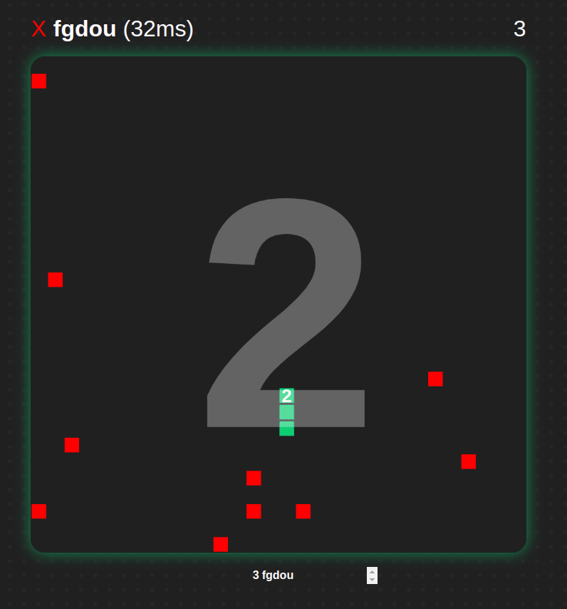

Report - Fabien GOARDOU
===

# Idea

The idea is to create a snake game, but multiplayer. The idea is to copy the classical game :
- a fixed size grid
- only one apple for everyone
- movement every time $t$
- every apple increment the size of the player

# Design
See the [design file](./design.md) for explainig the architecture.

## Backend
Rust is usefull to have a performant backend. It is also very handy for a lot of usecase in this project, because it is  a functional programming language. Many `enum` are used to transfer data accross the front and backend.

The Backend handles all the game logic. The position and the direction is stored here. It receives the command from the users for the direction, and first sends the position of everyone and the apple.

## Frontend
Typscript will be the easiest for frontend development but will still allow for type checking. I chose to not work with any frameworks, because this is a simple frontend.

The frontend will draw the players sent by the server and send every keys sent by the user. It will also execute the game logic for the client, as the server will only send basic modifications of the game : 
- change direction of the player
- new player
- eating an apple

## Link between Frontend and Backend
WeSocket is a common way to communication between a client and a server. It works exactly like TCP, but over HTTP. It has reliability and orderness, but is easier to implement in a web-browser.

The rust crate `ts-rs` provides a compilation from the Rust objects to typescript. In that way, we can use in the frontend the exact objects defined in the backend.

The messages are the followings :
- send the entier game state via the [`Infos`](../backend/src/objects/infos.rs) object
- send only the changes via the [`Event`](../backend/src/objects/infos_change.rs) object

## Docker
Docker allows this app to be run on any devices. I chose to put the front and backend in the same docker, to be able to run it with a really simple command : `docker run app`. It runs the front with nginx, and the back with a binary. The image is small : 110MB.

The build steps are defined in the [`Dockerfile`](../Dockerfile). To avoid CORS errors, nginx is used to link the front and backend on the same url and port.

## LoadTesting

The goal of the loadtesting is to run as many users as we can until the server slows down. To do that, the code connects in websocket to the backend, sends a user position. Then, it sends periodicly a movement to stay alive. Also, it returns the average ping.

The test continues until the server cannot accept more user, the ping is too high, or the time spent is greater than 1 min. When this condition is met, the test continues for 5 seconds with the same number of players.

The load testing shows great results : 369 players with 522 ms ping.
Basically, the server does not accept more players because there are no more spaces left on the board. So even with a lot of connections, the server handles everything in less than a second.

# Challenges

## Ping reliability
The `Client` classcalculate the average time difference that the network takes. With  this estimation, it can smooth out the receiving of packet, so that the game seems smoother. You can see the implementation in the [`MessageTPSSmoother`](../frontend/src/MessageTPSSmoother.ts) class.

$$T_{wait}(n) = T_{n} - T_{n-1} - T_{frame}$$
$$T_{frame} = 300ms$$

For a long time, the ping was rughtly 100ms. But it turned out that [this commit](https://github.com/Fgdou/sr_project/commit/e6f07d262497ed2079f0debe3b342bcab02b4b32) fixed it to bring it down to 30ms. The issue was that I was storing only the high ping, which added up the error over time, instead of taking the average.

## Error detection
For every message received, an id is linked to it. The `Client` module compares it, and if there is an error, ask the server to send the full information.

## XSS Attacks
When I first tried my game with my friends, they started putting html elements in the username... So it caused issues. So I implemented 2 conditions :
1. must be 10 characters max
2. must be only alphanumeric

## Docker build time
The docker build time was 2 minutes for each commit and pull request. This is a bit long to wait when you want to deploy. The issue is that the build process in the [`Dockerfile`](../Dockerfile) download and build the libraries each time. The solution was to add a step between building libraries and the code, so that every step is cached. If we do a modification to the code, it will only build the new code. [This commit](https://github.com/Fgdou/sr_project/commit/f1fac72bf3ed3c4de22382c6b8e453ee7b0a98b1) divided the time by 2.

# Decision of the game
## Connection
When the player connected, the game checks if there is space and if the username is correct. If so, the player is placed and allowed to play.

## Game Logic
All the game logic is based on the server, and the server handle every movement and action. How every, only the changements are sent to the player. Meaning: the player gets all the information of the game, and then gets only the new directions of the other players. This way, the networks have less data to transfer.

## Player in the same position
If 2 players goes on the same tile at once, then both player will loose. This is because the game will start by moving the player, and then check if they are colliding with other players.

2 Playes can't eat the same apple, because they will die on the same tile.

## Player Spawn
A player have to have a radius of 3 blocks aroudn to be able to spawn and play.

# Responsive
The goal of the website is to be able to be played on a computer and a phone. For that, gesture and css on mobile is implemented.

# Work Organization
This project is organized aroung one tool : **GitHub**. It has a `master` and `develop` branches, along with a pipeline :
1. each commit to `develop` is build and tested
2. each merge to `master` has to pass the build and will be published as a docker image

The pipeline builds every package and ensure that the full project builds before merging into `master`.

Also, to reference new features or bugs, I use the [GitHub issues](https://github.com/Fgdou/sr_project/issues) of the project. This way, I only focus on one main task at a time.

# Unit test
Some components of the `backend` have unit testing. Those tests are located in the same files as the function tested.